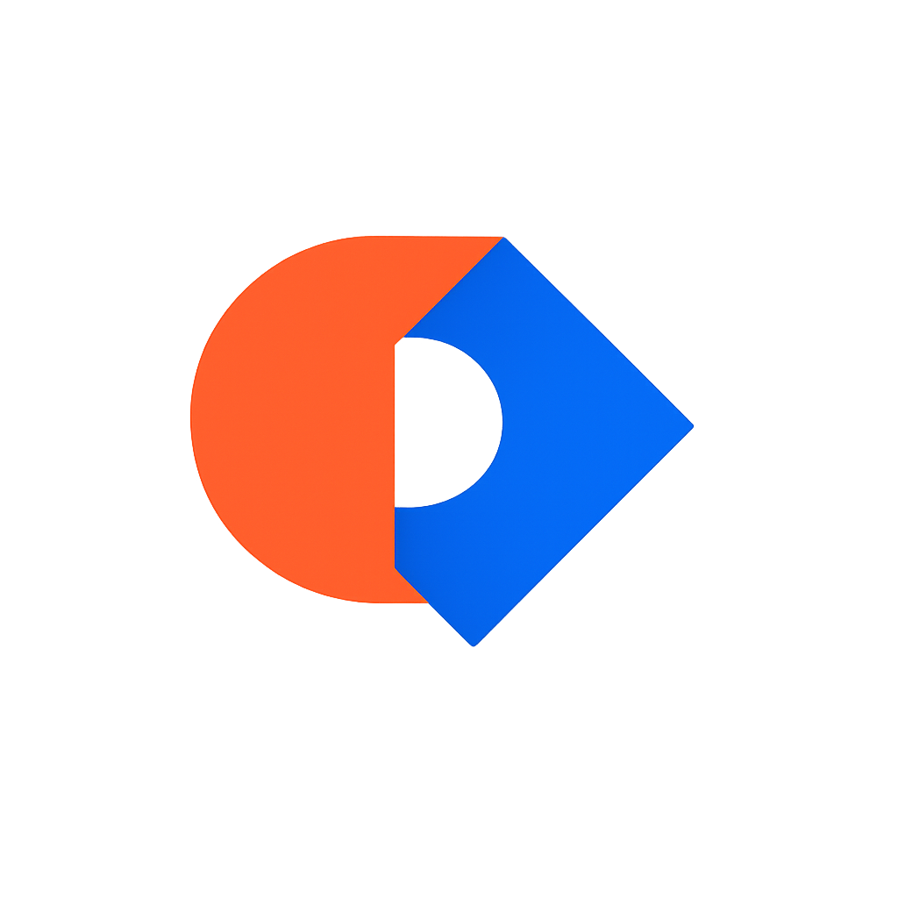

<!-- Font Awesome CDN -->
<link rel="stylesheet" href="https://cdnjs.cloudflare.com/ajax/libs/font-awesome/6.4.0/css/all.min.css">

# <i class="fas fa-rocket"></i> Droy Programming Language

<p align="center">
  
</p>

<p align="center">
  <b><i class="fas fa-code"></i> A Complete Markup & Programming Language Built from Scratch</b>
</p>

<p align="center">
  <a href="https://github.com/droy-go/droy-lang/releases"></a>
  <a href="LICENSE"></a>
  <a href="https://github.com/droy-go/droy-lang/stargazers"></a>
  <a href="https://github.com/droy-go/droy-lang/issues"></a>
  <a href="https://github.com/droy-go/droy-lang/network/members"></a>
</p>

<p align="center">
  <a href="#-english"><i class="fas fa-flag-usa"></i> English</a> |
  <a href="#-العربية"><i class="fas fa-language"></i> العربية</a> |
  <a href="#-中文"><i class="fas fa-language"></i> 中文</a> |
  <a href="#-français"><i class="fas fa-language"></i> Français</a> |
  <a href="#-日本語"><i class="fas fa-language"></i> 日本語</a>
</p>

---

## <i class="fas fa-flag-usa"></i> English

### <i class="fas fa-star"></i> Features

| Feature | Description | Icon |
|---------|-------------|------|
| **Complete Implementation** | Lexer, Parser, AST, and Interpreter built from scratch in C | <i class="fas fa-bullseye"></i> |
| **LLVM Backend** | Native compilation to LLVM IR for high-performance execution | <i class="fas fa-bolt"></i> |
| **Professional Web IDE** | Browser-based editor with syntax highlighting and auto-completion | <i class="fas fa-globe"></i> |
| **Advanced Link System** | Create and manage dynamic links with `link`, `create-link`, `open-link` | <i class="fas fa-link"></i> |
| **Style Engine** | Built-in styling capabilities similar to CSS | <i class="fas fa-palette"></i> |
| **Special Variables** | `@si`, `@ui`, `@yui`, `@pop`, `@abc` for system integration | <i class="fas fa-wrench"></i> |
| **Command System** | Powerful commands like `*/employment`, `*/Running`, `*/pressure`, `*/lock` | <i class="fas fa-box"></i> |
| **Package Management** | Load packages with `pkg load` | <i class="fas fa-cubes"></i> |
| **DLp Package Manager** | Official package manager written in C | <i class="fas fa-box-open"></i> |
| **Media Handling** | Built-in media controls with `media play` and `media stop` | <i class="fas fa-film"></i> |
| **Block System** | Define reusable code blocks | <i class="fas fa-cube"></i> |

### <i class="fas fa-rocket"></i> Quick Start

```bash
# Clone the repository
git clone https://github.com/droy-go/droy-lang.git
cd droy-lang

# Build the compiler
make

# Run an example
./bin/droy examples/hello.droy
```

### <i class="fas fa-laptop-code"></i> Language Syntax

```droy
// Variables
set name = "Droy"
~s @si = 100

// Output
text "Hello, World!"
em @si + " " + @ui

// Math operations
set sum = 10 + 5
set product = 10 * 5

// Links
link id: "homepage" api: "https://example.com"
create-link: "homepage"
open-link: "homepage"

// Commands
*/employment
*/Running
```

### <i class="fas fa-tools"></i> Compiler Options

| Option | Description | Icon |
|--------|-------------|------|
| `-h` | Show help | <i class="fas fa-question-circle"></i> |
| `-v` | Version info | <i class="fas fa-info-circle"></i> |
| `-t` | Print tokens | <i class="fas fa-terminal"></i> |
| `-a` | Print AST | <i class="fas fa-sitemap"></i> |
| `-c` | Compile to LLVM IR | <i class="fas fa-microchip"></i> |
| `-i` | Interactive REPL | <i class="fas fa-keyboard"></i> |

### <i class="fas fa-folder-open"></i> Project Structure

```
droy-lang/
├── <i class="fas fa-folder"></i> include/
│   └── <i class="fas fa-file-code"></i> droy.h              # Core header
├── <i class="fas fa-folder"></i> src/
│   ├── <i class="fas fa-file-code"></i> lexer.c             # Lexical analyzer
│   ├── <i class="fas fa-file-code"></i> parser.c            # Parser
│   ├── <i class="fas fa-file-code"></i> interpreter.c       # Interpreter
│   └── <i class="fas fa-file-code"></i> main.c              # CLI entry
├── <i class="fas fa-folder"></i> editor/
│   ├── <i class="fab fa-html5"></i> index.html              # Web IDE
│   ├── <i class="fab fa-css3-alt"></i> editor.css           # Styles
│   ├── <i class="fab fa-js"></i> editor.js                  # Logic
│   └── <i class="fas fa-file-code"></i> droy-mode.js        # CodeMirror mode
├── <i class="fas fa-folder"></i> llvm/
│   └── <i class="fas fa-microchip"></i> droy_backend.cpp    # LLVM backend
├── <i class="fas fa-folder"></i> DLp-c/                    # <i class="fas fa-box-open"></i> DLp Package Manager
│   ├── <i class="fas fa-folder"></i> src/
│   ├── <i class="fas fa-folder"></i> include/
│   ├── <i class="fas fa-folder"></i> bin/
│   └── <i class="fas fa-file"></i> Makefile
├── <i class="fas fa-folder"></i> examples/
│   ├── <i class="fas fa-file"></i> hello.droy               # Hello World
│   ├── <i class="fas fa-file"></i> variables.droy           # Variables
│   ├── <i class="fas fa-file"></i> math.droy                # Math
│   ├── <i class="fas fa-file"></i> links.droy               # Links
│   └── <i class="fas fa-file"></i> blocks.droy              # Blocks
├── <i class="fas fa-file"></i> Makefile
└── <i class="fas fa-file-alt"></i> README.md
```

---

## <i class="fas fa-box-open"></i> DLp - Droy Language Package Manager

<p>
  <i class="fas fa-rocket"></i> <b>DLp</b> is the official package manager for Droy Programming Language - Written in C for optimal performance.
</p>

### <i class="fas fa-star"></i> DLp Features

| Feature | Description | Icon |
|---------|-------------|------|
| **Package Management** | Install, update, and manage Droy packages | <i class="fas fa-cube"></i> |
| **Build System** | Compile to LLVM IR, binary, or assembly | <i class="fas fa-hammer"></i> |
| **Project Scaffolding** | Create new projects with templates | <i class="fas fa-drafting-compass"></i> |
| **Testing** | Run tests and check code quality | <i class="fas fa-vial"></i> |
| **Package Discovery** | Search and explore packages | <i class="fas fa-search"></i> |
| **System Health** | Check and fix system configuration | <i class="fas fa-stethoscope"></i> |
| **Fast & Lightweight** | Written in C for optimal performance | <i class="fas fa-feather-alt"></i> |

### <i class="fas fa-download"></i> Installing DLp

```bash
# Navigate to DLp-c directory
cd DLp-c

# Build DLp
make

# Install system-wide (optional)
sudo make install

# Or use locally
./bin/DLp
```

### <i class="fas fa-terminal"></i> DLp Quick Start

```bash
# Install Droy Language
DLp install

# Create new project
DLp init my-project
cd my-project

# Run project
DLp run

# Build project
DLp build
```

### <i class="fas fa-list"></i> DLp Commands

| Command | Description | Icon |
|---------|-------------|------|
| `DLp install` | Install Droy Language | <i class="fas fa-download"></i> |
| `DLp init <name>` | Create new project | <i class="fas fa-plus-circle"></i> |
| `DLp build [file]` | Build project | <i class="fas fa-hammer"></i> |
| `DLp run [file]` | Run Droy program | <i class="fas fa-play"></i> |
| `DLp add <pkg>` | Add package | <i class="fas fa-plus"></i> |
| `DLp remove <pkg>` | Remove package | <i class="fas fa-minus"></i> |
| `DLp update` | Update packages | <i class="fas fa-sync"></i> |
| `DLp list` | List packages | <i class="fas fa-list"></i> |
| `DLp search <query>` | Search packages | <i class="fas fa-search"></i> |
| `DLp test` | Run tests | <i class="fas fa-vial"></i> |
| `DLp clean` | Clean artifacts | <i class="fas fa-broom"></i> |
| `DLp repl` | Start REPL | <i class="fas fa-terminal"></i> |
| `DLp info` | Show info | <i class="fas fa-info-circle"></i> |
| `DLp doctor` | Check system | <i class="fas fa-stethoscope"></i> |

### <i class="fas fa-hammer"></i> DLp Build Targets

```bash
# Build to LLVM IR (default)
DLp build -t llvm

# Build to binary
DLp build -t bin -o myprogram

# Build to assembly
DLp build -t asm
```

### <i class="fas fa-file-code"></i> DLp Project Structure

```
my-project/
├── <i class="fas fa-folder"></i> src/
│   └── <i class="fas fa-file"></i> main.droy          # Main entry point
├── <i class="fas fa-folder"></i> tests/               # Test files
├── <i class="fas fa-folder"></i> examples/            # Example programs
├── <i class="fas fa-folder"></i> dist/                # Build output
├── <i class="fas fa-file-cog"></i> droy.toml         # Project config
├── <i class="fas fa-file-alt"></i> README.md         # Documentation
└── <i class="fas fa-file"></i> .gitignore            # Git ignore rules
```

### <i class="fas fa-cog"></i> DLp Configuration (droy.toml)

```toml
[project]
name = "my-project"
version = "1.0.0"
description = "My Droy project"
author = "Your Name"
license = "MIT"

[build]
output = "dist"
target = "llvm"
optimize = true

[scripts]
start = "DLp run src/main.droy"
build = "DLp build"
test = "DLp test"

[dependencies]
```

---

## <i class="fas fa-language"></i> العربية

### <i class="fas fa-star"></i> المميزات

| الميزة | الوصف | الأيقونة |
|--------|-------|----------|
| **تنفيذ كامل** | محلل لغوي، محلل نحوي، شجرة بناء مجردة، ومفسر مبني من الصفر بلغة C | <i class="fas fa-bullseye"></i> |
| **خلفية LLVM** | تجميع أصلي إلى LLVM IR للأداء العالي | <i class="fas fa-bolt"></i> |
| **محرر ويب احترافي** | محرك متكامل في المتصفح مع تمييز الصياغة والإكمال التلقائي | <i class="fas fa-globe"></i> |
| **نظام روابط متقدم** | إنشاء وإدارة الروابط الديناميكية | <i class="fas fa-link"></i> |
| **محرك التصميم** | قدرات تصميم مدمجة تشبه CSS | <i class="fas fa-palette"></i> |
| **متغيرات خاصة** | `@si`, `@ui`, `@yui`, `@pop`, `@abc` للتكامل مع النظام | <i class="fas fa-wrench"></i> |
| **نظام الأوامر** | أوامر قوية مثل `*/employment`, `*/Running`, `*/pressure`, `*/lock` | <i class="fas fa-box"></i> |
| **مدير الحزم DLp** | مدير الحزم الرسمي مكتوب بلغة C | <i class="fas fa-box-open"></i> |

### <i class="fas fa-rocket"></i> البدء السريع

```bash
# استنساخ المستودع
git clone https://github.com/droy-go/droy-lang.git
cd droy-lang

# بناء المترجم
make

# تشغيل مثال
./bin/droy examples/hello.droy
```

### <i class="fas fa-laptop-code"></i> صياغة اللغة

```droy
// المتغيرات
set name = "Droy"
~s @si = 100

// الإخراج
text "مرحباً بالعالم!"
em @si + " " + @ui

// العمليات الحسابية
set sum = 10 + 5
set product = 10 * 5

// الروابط
link id: "homepage" api: "https://example.com"
create-link: "homepage"
open-link: "homepage"

// الأوامر
*/employment
*/Running
```

### <i class="fas fa-tools"></i> خيارات المترجم

| الخيار | الوصف | الأيقونة |
|--------|-------|----------|
| `-h` | عرض المساعدة | <i class="fas fa-question-circle"></i> |
| `-v` | معلومات الإصدار | <i class="fas fa-info-circle"></i> |
| `-t` | طباعة الرموز | <i class="fas fa-terminal"></i> |
| `-a` | طباعة شجرة البناء المجردة | <i class="fas fa-sitemap"></i> |
| `-c` | التجميع إلى LLVM IR | <i class="fas fa-microchip"></i> |
| `-i` | وضع REPL التفاعلي | <i class="fas fa-keyboard"></i> |

---

## <i class="fas fa-language"></i> 中文

### <i class="fas fa-star"></i> 特性

| 特性 | 描述 | 图标 |
|------|------|------|
| **完整实现** | 使用 C 语言从头构建的词法分析器、解析器、AST 和解释器 | <i class="fas fa-bullseye"></i> |
| **LLVM 后端** | 原生编译为 LLVM IR，实现高性能执行 | <i class="fas fa-bolt"></i> |
| **专业 Web IDE** | 基于浏览器的编辑器，支持语法高亮和自动补全 | <i class="fas fa-globe"></i> |
| **高级链接系统** | 创建和管理动态链接 | <i class="fas fa-link"></i> |
| **样式引擎** | 内置类似 CSS 的样式功能 | <i class="fas fa-palette"></i> |
| **特殊变量** | `@si`, `@ui`, `@yui`, `@pop`, `@abc` 用于系统集成 | <i class="fas fa-wrench"></i> |
| **命令系统** | 强大的命令如 `*/employment`, `*/Running`, `*/pressure`, `*/lock` | <i class="fas fa-box"></i> |
| **DLp 包管理器** | 用 C 语言编写的官方包管理器 | <i class="fas fa-box-open"></i> |

### <i class="fas fa-rocket"></i> 快速开始

```bash
# 克隆仓库
git clone https://github.com/droy-go/droy-lang.git
cd droy-lang

# 构建编译器
make

# 运行示例
./bin/droy examples/hello.droy
```

### <i class="fas fa-laptop-code"></i> 语言语法

```droy
// 变量
set name = "Droy"
~s @si = 100

// 输出
text "你好，世界！"
em @si + " " + @ui

// 数学运算
set sum = 10 + 5
set product = 10 * 5

// 链接
link id: "homepage" api: "https://example.com"
create-link: "homepage"
open-link: "homepage"

// 命令
*/employment
*/Running
```

### <i class="fas fa-tools"></i> 编译器选项

| 选项 | 描述 | 图标 |
|------|------|------|
| `-h` | 显示帮助 | <i class="fas fa-question-circle"></i> |
| `-v` | 版本信息 | <i class="fas fa-info-circle"></i> |
| `-t` | 打印词元 | <i class="fas fa-terminal"></i> |
| `-a` | 打印 AST | <i class="fas fa-sitemap"></i> |
| `-c` | 编译为 LLVM IR | <i class="fas fa-microchip"></i> |
| `-i` | 交互式 REPL | <i class="fas fa-keyboard"></i> |

---

## <i class="fas fa-language"></i> Français

### <i class="fas fa-star"></i> Caractéristiques

| Caractéristique | Description | Icône |
|-----------------|-------------|-------|
| **Implémentation Complète** | Lexer, Parser, AST et Interpréteur construits from scratch en C | <i class="fas fa-bullseye"></i> |
| **Backend LLVM** | Compilation native vers LLVM IR pour une exécution haute performance | <i class="fas fa-bolt"></i> |
| **IDE Web Professionnel** | Éditeur basé sur navigateur avec coloration syntaxique et auto-complétion | <i class="fas fa-globe"></i> |
| **Système de Liens Avancé** | Création et gestion dynamique de liens | <i class="fas fa-link"></i> |
| **Moteur de Style** | Capacités de style intégrées similaires à CSS | <i class="fas fa-palette"></i> |
| **Variables Spéciales** | `@si`, `@ui`, `@yui`, `@pop`, `@abc` pour l'intégration système | <i class="fas fa-wrench"></i> |
| **Système de Commandes** | Commandes puissantes comme `*/employment`, `*/Running`, `*/pressure`, `*/lock` | <i class="fas fa-box"></i> |
| **Gestionnaire de Paquets DLp** | Gestionnaire de paquets officiel écrit en C | <i class="fas fa-box-open"></i> |

### <i class="fas fa-rocket"></i> Démarrage Rapide

```bash
# Cloner le dépôt
git clone https://github.com/droy-go/droy-lang.git
cd droy-lang

# Construire le compilateur
make

# Exécuter un exemple
./bin/droy examples/hello.droy
```

### <i class="fas fa-laptop-code"></i> Syntaxe du Langage

```droy
// Variables
set name = "Droy"
~s @si = 100

// Sortie
text "Bonjour le Monde!"
em @si + " " + @ui

// Opérations mathématiques
set sum = 10 + 5
set product = 10 * 5

// Liens
link id: "homepage" api: "https://example.com"
create-link: "homepage"
open-link: "homepage"

// Commandes
*/employment
*/Running
```

### <i class="fas fa-tools"></i> Options du Compilateur

| Option | Description | Icône |
|--------|-------------|-------|
| `-h` | Afficher l'aide | <i class="fas fa-question-circle"></i> |
| `-v` | Info version | <i class="fas fa-info-circle"></i> |
| `-t` | Afficher les tokens | <i class="fas fa-terminal"></i> |
| `-a` | Afficher l'AST | <i class="fas fa-sitemap"></i> |
| `-c` | Compiler vers LLVM IR | <i class="fas fa-microchip"></i> |
| `-i` | REPL interactif | <i class="fas fa-keyboard"></i> |

---

## <i class="fas fa-language"></i> 日本語

### <i class="fas fa-star"></i> 特徴

| 特徴 | 説明 | アイコン |
|------|------|----------|
| **完全な実装** | C言語でゼロから構築されたレキサー、パーサー、AST、インタプリタ | <i class="fas fa-bullseye"></i> |
| **LLVMバックエンド** | 高性能実行のためのLLVM IRへのネイティブコンパイル | <i class="fas fa-bolt"></i> |
| **プロフェッショナルWeb IDE** | シンタックスハイライトと自動補完機能を備えたブラウザベースのエディタ | <i class="fas fa-globe"></i> |
| **高度なリンクシステム** | 動的リンクの作成と管理 | <i class="fas fa-link"></i> |
| **スタイルエンジン** | CSSに似った組み込みスタイル機能 | <i class="fas fa-palette"></i> |
| **特殊変数** | システム統合のための `@si`, `@ui`, `@yui`, `@pop`, `@abc` | <i class="fas fa-wrench"></i> |
| **コマンドシステム** | `*/employment`, `*/Running`, `*/pressure`, `*/lock` などの強力なコマンド | <i class="fas fa-box"></i> |
| **DLp パッケージマネージャー** | C言語で書かれた公式パッケージマネージャー | <i class="fas fa-box-open"></i> |

### <i class="fas fa-rocket"></i> クイックスタート

```bash
# リポジトリをクローン
git clone https://github.com/droy-go/droy-lang.git
cd droy-lang

# コンパイラをビルド
make

# サンプルを実行
./bin/droy examples/hello.droy
```

### <i class="fas fa-laptop-code"></i> 言語構文

```droy
// 変数
set name = "Droy"
~s @si = 100

// 出力
text "こんにちは、世界！"
em @si + " " + @ui

// 数学演算
set sum = 10 + 5
set product = 10 * 5

// リンク
link id: "homepage" api: "https://example.com"
create-link: "homepage"
open-link: "homepage"

// コマンド
*/employment
*/Running
```

### <i class="fas fa-tools"></i> コンパイラオプション

| オプション | 説明 | アイコン |
|-----------|------|----------|
| `-h` | ヘルプを表示 | <i class="fas fa-question-circle"></i> |
| `-v` | バージョン情報 | <i class="fas fa-info-circle"></i> |
| `-t` | トークンを出力 | <i class="fas fa-terminal"></i> |
| `-a` | ASTを出力 | <i class="fas fa-sitemap"></i> |
| `-c` | LLVM IRにコンパイル | <i class="fas fa-microchip"></i> |
| `-i` | インタラクティブREPL | <i class="fas fa-keyboard"></i> |

---

## <i class="fas fa-folder-tree"></i> Project Structure | هيكل المشروع | 项目结构 | Structure du Projet | プロジェクト構造

```
droy-lang/
├── <i class="fas fa-folder text-yellow"></i> include/
│   └── <i class="fas fa-file-code text-blue"></i> droy.h              # Core header | رأسية النواة | 核心头文件 | En-tête principal | コアヘッダー
├── <i class="fas fa-folder text-yellow"></i> src/
│   ├── <i class="fas fa-file-code text-blue"></i> lexer.c             # Lexical analyzer | المحلل اللغوي | 词法分析器 | Analyseur lexical | レキサー
│   ├── <i class="fas fa-file-code text-blue"></i> parser.c            # Parser | المحلل النحوي | 解析器 | Parseur | パーサー
│   ├── <i class="fas fa-file-code text-blue"></i> interpreter.c       # Interpreter | المفسر | 解释器 | Interpréteur | インタプリタ
│   └── <i class="fas fa-file-code text-blue"></i> main.c              # CLI entry | نقطة الدخول | 入口点 | Point d'entrée | エントリーポイント
├── <i class="fas fa-folder text-yellow"></i> editor/
│   ├── <i class="fab fa-html5 text-orange"></i> index.html            # Web IDE | محرر الويب | Web编辑器 | IDE Web | Web IDE
│   ├── <i class="fab fa-css3-alt text-blue"></i> editor.css           # Styles | الأنماط | 样式 | Styles | スタイル
│   ├── <i class="fab fa-js text-yellow"></i> editor.js                # Logic | المنطق | 逻辑 | Logique | ロジック
│   └── <i class="fas fa-file-code text-blue"></i> droy-mode.js        # CodeMirror mode | وضع CodeMirror | CodeMirror模式 | Mode CodeMirror | CodeMirrorモード
├── <i class="fas fa-folder text-yellow"></i> llvm/
│   └── <i class="fas fa-microchip text-purple"></i> droy_backend.cpp  # LLVM backend | خلفية LLVM | LLVM后端 | Backend LLVM | LLVMバックエンド
├── <i class="fas fa-folder text-yellow"></i> DLp-c/                    # <i class="fas fa-box-open"></i> Package Manager | مدير الحزم | 包管理器 | Gestionnaire de Paquets | パッケージマネージャー
│   ├── <i class="fas fa-folder text-yellow"></i> src/
│   ├── <i class="fas fa-folder text-yellow"></i> include/
│   ├── <i class="fas fa-folder text-yellow"></i> bin/
│   └── <i class="fas fa-file text-gray"></i> Makefile
├── <i class="fas fa-folder text-yellow"></i> examples/
│   ├── <i class="fas fa-file text-green"></i> hello.droy              # Hello World | مرحباً بالعالم | 你好世界 | Bonjour le Monde | こんにちは世界
│   ├── <i class="fas fa-file text-green"></i> variables.droy          # Variables | المتغيرات | 变量 | Variables | 変数
│   ├── <i class="fas fa-file text-green"></i> math.droy               # Math | الرياضيات | 数学 | Mathématiques | 数学
│   ├── <i class="fas fa-file text-green"></i> links.droy              # Links | الروابط | 链接 | Liens | リンク
│   └── <i class="fas fa-file text-green"></i> blocks.droy             # Blocks | الكتل | 块 | Blocs | ブロック
├── <i class="fas fa-file text-gray"></i> Makefile
└── <i class="fas fa-file-alt text-gray"></i> README.md
```

---

## <i class="fas fa-hands-helping"></i> Contributing | المساهمة | 贡献 | Contribution | 貢献

<p>
  <i class="fas fa-flag-usa"></i> <b>English</b>: Contributions are welcome! Please read our <a href="CONTRIBUTING.md"><i class="fas fa-book"></i> Contributing Guide</a> and submit a Pull Request.
</p>

<p>
  <i class="fas fa-language"></i> <b>العربية</b>: المساهمات مرحب بها! يرجى قراءة <a href="CONTRIBUTING.md"><i class="fas fa-book"></i> دليل المساهمة</a> وإرسال طلب سحب.
</p>

<p>
  <i class="fas fa-language"></i> <b>中文</b>: 欢迎贡献！请阅读我们的<a href="CONTRIBUTING.md"><i class="fas fa-book"></i> 贡献指南</a>并提交 Pull Request。
</p>

<p>
  <i class="fas fa-language"></i> <b>Français</b>: Les contributions sont les bienvenues ! Veuillez lire notre <a href="CONTRIBUTING.md"><i class="fas fa-book"></i> Guide de Contribution</a> et soumettre une Pull Request.
</p>

<p>
  <i class="fas fa-language"></i> <b>日本語</b>: 貢献を歓迎します！<a href="CONTRIBUTING.md"><i class="fas fa-book"></i> 貢献ガイド</a>をお読みいただき、Pull Requestを送信してください。
</p>

---

## <i class="fas fa-balance-scale"></i> License | الترخيص | 许可证 | Licence | ライセンス

<p>
  <i class="fas fa-gavel"></i> This project is licensed under the <a href="LICENSE">MIT License</a>.
</p>

---

## <i class="fas fa-heart"></i> Acknowledgments

- <i class="fas fa-users"></i> Thanks to all contributors who have helped shape Droy
- <i class="fas fa-lightbulb"></i> Inspired by modern programming languages and markup systems
- <i class="fas fa-fire"></i> Built with passion for clean, expressive code

---

<p align="center">
  <b><i class="fas fa-star"></i> Star us on GitHub if you find this project useful! <i class="fas fa-star"></i></b>
</p>

<p align="center">
  <i class="fas fa-code"></i> <i>Code with Power, Build with Style</i> <i class="fas fa-paint-brush"></i> |
  <i>برمجة بالقوة، بناء بالأناقة</i> |
  <i>用力量编程，用风格构建</i> |
  <i>Codez avec Puissance, Construisez avec Style</i> |
  <i>力を持ってコードを、スタイルを持って構築</i>
</p>

---

<p align="center">
  <i class="fas fa-heart text-red"></i> Made with love by <a href="https://github.com/droy-go"><i class="fab fa-github"></i> droy-go</a>
</p>
